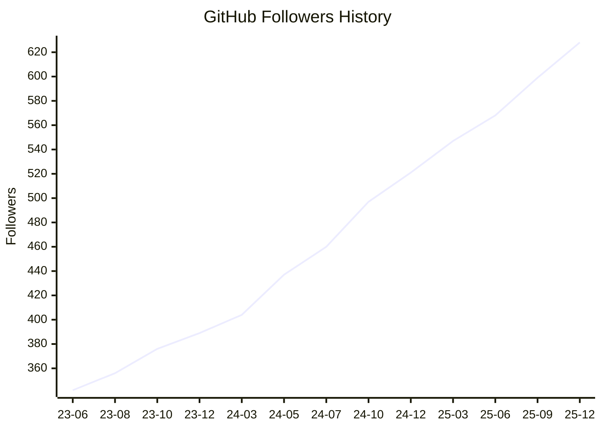

## 👋 Hi! I'm O-TYAN64

<p align="left"> 
  <a href="https://github.com/O-TYAN64/O-TYAN64/"></a>
  <a href="https://github.com/O-TYAN64"></a>
  <a href="https://github.com/O-TYAN64"></a>
  <a href="https://gitstar-ranking.com/O-TYAN64"></a>
  <a href="https://user-badge.committers.top/japan/O-TYAN64"></a>
  <a href="https://github.com/gayanvoice/top-github-users/blob/main/markdown/followers/japan.md"></a>
</p>


<p align="left">
  <a href="https://qiita.com/O-TYAN64"></a>
  <a href="https://qiita.com/O-TYAN64"></a>
</p>

<p align="left">
  <a href="https://x.com/otyanvrchat64"></a>
  <a href="https://qiita.com/O-TYAN64"></a>
</p>

### Development Environment

<!--START_SECTION:github_profile_bio-->
<!--END_SECTION:github_profile_bio-->

### Recent Activities

<p align="left">
  <!-- <a href="https://github.com/anuraghazra/github-readme-stats"></a> -->
  <a href="https://github.com/vn7n24fzkq/github-profile-summary-cards"></a>
  <a href="https://github.com/DenverCoder1/github-readme-streak-stats"></a>
</p>

[](https://github.com/vn7n24fzkq/github-profile-summary-cards)
[](https://github.com/Ashutosh00710/github-readme-activity-graph)

### Languages

[](https://github.com/vn7n24fzkq/github-profile-summary-cards)
[](https://github.com/vn7n24fzkq/github-profile-summary-cards)
[](https://github.com/anuraghazra/github-readme-stats)

### OSS Insight

<!-- Copy-paste in your Readme.md file -->

<a href="https://next.ossinsight.io/widgets/official/compose-user-dashboard-stats?user_id=132059813" target="_blank" style="display: block" align="center">
  <picture>
    <source media="(prefers-color-scheme: dark)" srcset="https://next.ossinsight.io/widgets/official/compose-user-dashboard-stats/thumbnail.png?user_id=132059813&image_size=auto&color_scheme=dark" width="771" height="auto">
    
  </picture>
</a>

<!-- Made with [OSS Insight](https://ossinsight.io/) -->

<!-- Copy-paste in your Readme.md file -->

<a href="https://next.ossinsight.io/widgets/official/compose-currently-working-on?user_id=132059813&activity_type=all" target="_blank" style="display: block" align="center">
  <picture>
    <source media="(prefers-color-scheme: dark)" srcset="https://next.ossinsight.io/widgets/official/compose-currently-working-on/thumbnail.png?user_id=132059813&activity_type=all&image_size=auto&color_scheme=dark" width="497.5" height="auto">
    
  </picture>
</a>

<!-- Made with [OSS Insight](https://ossinsight.io/) -->
<!--
### Achievement

[](https://github.com/ryo-ma/github-profile-trophy)
-->

### Metrics

<details>
  <summary>GitHub Metrics</summary>

<!--  -->

[](https://github.com/lowlighter/metrics)

</details>

### Wakatime Analysis

<!--  -->

<details>
  <summary>Other Statics</summary>

  <!--START_SECTION:waka-->


**🐱 My GitHub Data** 

> 📦 220.2 kB Used in GitHub's Storage 
 > 
> 🏆 277 Contributions in the Year 2026
 > 
> 🚫 Not Opted to Hire
 > 
> 📜 116 Public Repositories 
 > 
> 🔑 5 Private Repositories 
 > 
**I'm an Early 🐤** 

```text
🌞 Morning                9410 commits        ██████░░░░░░░░░░░░░░░░░░░   24.05 % 
🌆 Daytime                13478 commits       █████████░░░░░░░░░░░░░░░░   34.45 % 
🌃 Evening                10472 commits       ███████░░░░░░░░░░░░░░░░░░   26.77 % 
🌙 Night                  5761 commits        ████░░░░░░░░░░░░░░░░░░░░░   14.73 % 
```
📅 **I'm Most Productive on Tuesday** 

```text
Monday                   6255 commits        ████░░░░░░░░░░░░░░░░░░░░░   15.99 % 
Tuesday                  6595 commits        ████░░░░░░░░░░░░░░░░░░░░░   16.86 % 
Wednesday                6418 commits        ████░░░░░░░░░░░░░░░░░░░░░   16.41 % 
Thursday                 6332 commits        ████░░░░░░░░░░░░░░░░░░░░░   16.19 % 
Friday                   5782 commits        ████░░░░░░░░░░░░░░░░░░░░░   14.78 % 
Saturday                 3671 commits        ██░░░░░░░░░░░░░░░░░░░░░░░   09.38 % 
Sunday                   4068 commits        ███░░░░░░░░░░░░░░░░░░░░░░   10.40 % 
```


📊 **This Week I Spent My Time On** 

```text
🕑︎ Time Zone: Asia/Tokyo

💬 Programming Languages: 
Other                    31 hrs 27 mins      ████████████████████░░░░░   81.26 % 
Lua                      2 hrs 49 mins       ██░░░░░░░░░░░░░░░░░░░░░░░   07.29 % 
YAML                     1 hr 23 mins        █░░░░░░░░░░░░░░░░░░░░░░░░   03.60 % 
TypeScript               56 mins             █░░░░░░░░░░░░░░░░░░░░░░░░   02.44 % 
Markdown                 50 mins             █░░░░░░░░░░░░░░░░░░░░░░░░   02.17 % 

🔥 Editors: 
Chrome                   37 hrs 52 mins      ████████████████████████░   97.83 % 
Neovim                   50 mins             █░░░░░░░░░░░░░░░░░░░░░░░░   02.17 % 

💻 Operating System: 
Linux                    38 hrs 42 mins      █████████████████████████   100.00 % 
```

**I Mostly Code in Lua** 

```text
Lua                      18 repos            ████████████░░░░░░░░░░░░░   46.15 % 
Shell                    6 repos             ████░░░░░░░░░░░░░░░░░░░░░   15.38 % 
HTML                     5 repos             ███░░░░░░░░░░░░░░░░░░░░░░   12.82 % 
TypeScript               3 repos             ██░░░░░░░░░░░░░░░░░░░░░░░   07.69 % 
Python                   1 repo              █░░░░░░░░░░░░░░░░░░░░░░░░   02.56 % 
```


**Timeline**


 Last Updated on 04/02/2026 19:51:49 UTC
<!--END_SECTION:waka-->
</details>

### GitHub Follower History

<!--START_SECTION:github_follower_history-->

<!--END_SECTION:github_follower_history-->

### This page status

[](https://u8views.com/github/O-TYAN64)

[](https://github.com/O-TYAN64/O-TYAN64/actions/workflows/main.yml)
