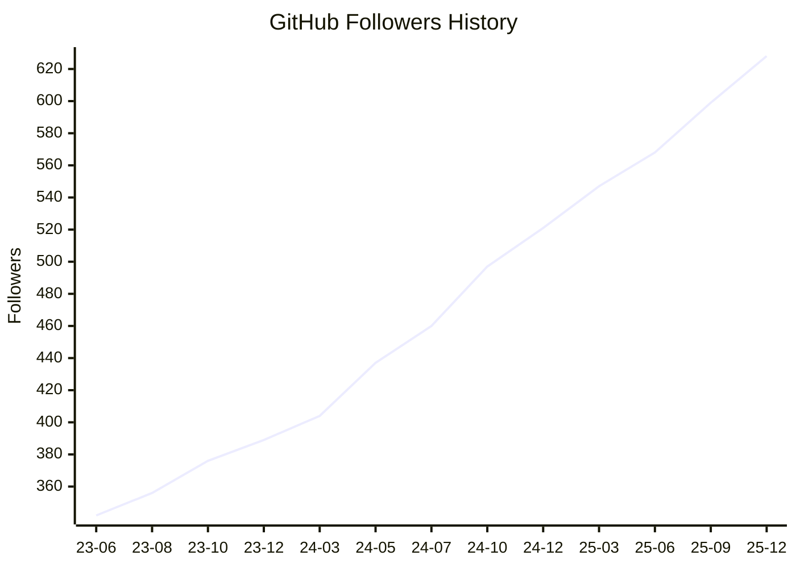

## 👋 Hi! I'm O-TYAN64

<p align="left"> 
  <a href="https://github.com/O-TYAN64/O-TYAN64/"></a>
  <a href="https://github.com/O-TYAN64"></a>
  <a href="https://github.com/O-TYAN64"></a>
  <a href="https://gitstar-ranking.com/O-TYAN64"></a>
  <a href="https://user-badge.committers.top/japan/O-TYAN64"></a>
  <a href="https://github.com/gayanvoice/top-github-users/blob/main/markdown/followers/japan.md"></a>
</p>


<p align="left">
  <a href="https://qiita.com/O-TYAN64"></a>
  <a href="https://qiita.com/O-TYAN64"></a>
</p>

<p align="left">
  <a href="https://x.com/otyanvrchat64"></a>
  <a href="https://qiita.com/O-TYAN64"></a>
</p>

### Recent Activities

<p align="left">
  <!-- <a href="https://github.com/anuraghazra/github-readme-stats"></a> -->
  <a href="https://github.com/vn7n24fzkq/github-profile-summary-cards"></a>
  <a href="https://github.com/DenverCoder1/github-readme-streak-stats"></a>
</p>

[](https://github.com/vn7n24fzkq/github-profile-summary-cards)
[](https://github.com/Ashutosh00710/github-readme-activity-graph)

### Languages

[](https://github.com/vn7n24fzkq/github-profile-summary-cards)
[](https://github.com/vn7n24fzkq/github-profile-summary-cards)
[](https://github.com/anuraghazra/github-readme-stats)

### OSS Insight

<!-- Copy-paste in your Readme.md file -->

<a href="https://next.ossinsight.io/widgets/official/compose-user-dashboard-stats?user_id=132059813" target="_blank" style="display: block" align="center">
  <picture>
    <source media="(prefers-color-scheme: dark)" srcset="https://next.ossinsight.io/widgets/official/compose-user-dashboard-stats/thumbnail.png?user_id=132059813&image_size=auto&color_scheme=dark" width="771" height="auto">
    
  </picture>
</a>

<!-- Made with [OSS Insight](https://ossinsight.io/) -->

<!-- Copy-paste in your Readme.md file -->

<a href="https://next.ossinsight.io/widgets/official/compose-currently-working-on?user_id=132059813&activity_type=all" target="_blank" style="display: block" align="center">
  <picture>
    <source media="(prefers-color-scheme: dark)" srcset="https://next.ossinsight.io/widgets/official/compose-currently-working-on/thumbnail.png?user_id=132059813&activity_type=all&image_size=auto&color_scheme=dark" width="497.5" height="auto">
    
  </picture>
</a>

<!-- Made with [OSS Insight](https://ossinsight.io/) -->
<!--
### Achievement

[](https://github.com/ryo-ma/github-profile-trophy)
-->

### Metrics

<details>
  <summary>GitHub Metrics</summary>

<!--  -->

[](https://github.com/lowlighter/metrics)

</details>

### Wakatime Analysis

<!--  -->

<details>
  <summary>Other Statics</summary>

  <!--START_SECTION:waka-->


**🐱 My GitHub Data** 

> 📦 255.2 kB Used in GitHub's Storage 
 > 
> 🏆 142 Contributions in the Year 2026
 > 
> 💼 Opted to Hire
 > 
> 📜 11 Public Repositories 
 > 
> 🔑 5 Private Repositories 
 > 
**I'm a Night 🦉** 

```text
🌞 Morning                0 commits           ░░░░░░░░░░░░░░░░░░░░░░░░░   00.00 % 
🌆 Daytime                80 commits          ██████░░░░░░░░░░░░░░░░░░░   23.95 % 
🌃 Evening                238 commits         ██████████████████░░░░░░░   71.26 % 
🌙 Night                  16 commits          █░░░░░░░░░░░░░░░░░░░░░░░░   04.79 % 
```
📅 **I'm Most Productive on Wednesday** 

```text
Monday                   46 commits          ███░░░░░░░░░░░░░░░░░░░░░░   13.77 % 
Tuesday                  55 commits          ████░░░░░░░░░░░░░░░░░░░░░   16.47 % 
Wednesday                136 commits         ██████████░░░░░░░░░░░░░░░   40.72 % 
Thursday                 58 commits          ████░░░░░░░░░░░░░░░░░░░░░   17.37 % 
Friday                   9 commits           █░░░░░░░░░░░░░░░░░░░░░░░░   02.69 % 
Saturday                 7 commits           █░░░░░░░░░░░░░░░░░░░░░░░░   02.10 % 
Sunday                   23 commits          ██░░░░░░░░░░░░░░░░░░░░░░░   06.89 % 
```


📊 **This Week I Spent My Time On** 

```text
🕑︎ Time Zone: America/Anchorage

💬 Programming Languages: 
No Activity Tracked This Week

🔥 Editors: 
No Activity Tracked This Week

💻 Operating System: 
No Activity Tracked This Week
```

**I Mostly Code in Python** 

```text
Python                   3 repos             ███████░░░░░░░░░░░░░░░░░░   27.27 % 
HTML                     2 repos             █████░░░░░░░░░░░░░░░░░░░░   18.18 % 
Batchfile                2 repos             █████░░░░░░░░░░░░░░░░░░░░   18.18 % 
JavaScript               2 repos             █████░░░░░░░░░░░░░░░░░░░░   18.18 % 
C++                      1 repo              ██░░░░░░░░░░░░░░░░░░░░░░░   09.09 % 
```


**Timeline**


 Last Updated on 05/02/2026 05:13:22 UTC
<!--END_SECTION:waka-->
</details>

### GitHub Follower History

<!--START_SECTION:github_follower_history-->

<!--END_SECTION:github_follower_history-->